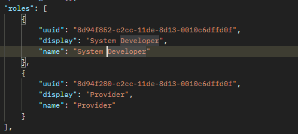
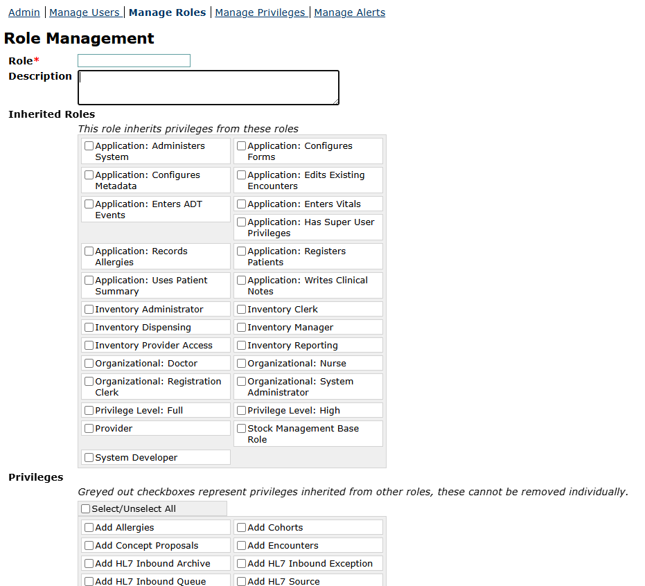
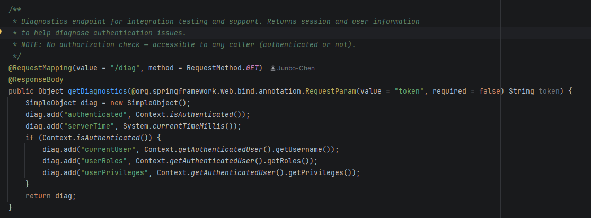
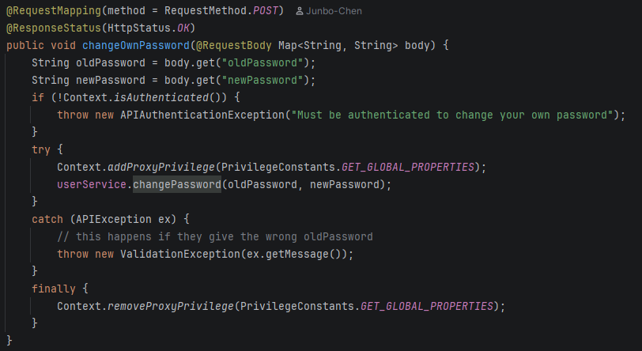

# Gap-analyse — openmrs-module-webservices.rest
Dit zijn gap analyses voor onze openmrs module
___

## Gap analyse 1

**Huidige situatie:** De OpenMRS-module heeft diverse rollen en biedt de mogelijkheid tot autorisatie via `@Authorized` annotaties in de code. Het probleem is dat de rollen `System Developer` en `Organizational: Admin` in de standaardinstellingen álle privileges krijgen.

**Gewenste situatie:** Volgens de `NEN-7510: 8.3 & 8.31` moet er een harde scheiding zijn tussen ICT-beheer en medische data. Ontwikkelaars mogen geen toegang hebben tot patiëntgegevens, tenzij er sprake is van een acute noodsituatie.

**Gap:** De standaard configuratie van OpenMRS scheidt ontwikkelaars systeemrechten niet van rechten die toegang bieden tot medische gegevens. Systeemrollen erven medische rechten automatisch over in plaats van dat deze expliciet worden geblokkeerd. Hierdoor is er nu geen technische barrière die voorkomt dat een ontwikkelaar medische data inziet.

**Risk:** Als het account van een beheerder of ontwikkelaar in productie wordt gehackt, liggen direct álle medische patiëntgegevens op straat. Dit leidt tot een zware overtreding van de `AVG` en `NEN-7510`, met een hoog risico op een boete.

**Oplossing:**
1. Maak een nieuwe rol `Technical Admin` aan, waarin alle vinkjes voor medische data (zoals `View Patients`) expliciet *uit* staan.
2. Zorg dat ontwikkelaars in testomgevingen alleen met onleesbaar gemaakte (gepseudonimiseerde) data werken.
3. Als een ontwikkelaar in patiëntgegevens wil kijken moet hij hier autorisatie voor aanvragen bij een rol met deze rechten. Alles wat de ontwikkelaar met deze patiëntgegevens doet wordt in een log opgeslagen.

**Source:**

___

## Gap analyse 2

**Huidige situatie:** Gevoelige gebruikersgegevens (gebruikersnaam en wachtwoord) worden onversleuteld meegestuurd in de API header via de `SessionController1_9`.

**Gewenste situatie:** Volgens de `NEN-7510: 8.3 & 8.5` moet de toegang tot medische API-endpoints zwaar beveiligd zijn. Authenticatie moet verplicht gebruikmaken van MFA en tijdelijke, cryptografisch beveiligde tokens (OAuth2 & JWT).

**Gap:** De `SessionController1_9` ondersteunt standaard geen moderne JWT-tokens en dwingt geen MFA af. Het ondersteunt Base64 wat makkelijk te achterhalen is.

**Risk:** Als een zorgverlener gehackt wordt liggen inloggegevens direct op straat. Omdat MFA ontbreekt, kan een hacker met dit gestolen wachtwoord direct patiëntgegevens opvragen en hier misbruik van maken.

**Oplossing:**
1. Routeer alle API-verzoeken via een centrale identity provider die MFA aanbiedt.
2. Pas de API-architectuur aan zodat er na de eerste inlog gebruik wordt gemaakt van een tijdelijk en uniek JWT-token, zodat wachtwoorden beveiligd met de API meegestuurd worden.
   **Source:**
   

___

## Gap analyse 3

**Huidige situatie:** De OpenMRS-module heeft meerdere controllers voor wachtwoordbeheer over verschillende mappen, zoals `ChangePasswordController1_8` en `PasswordResetController2_2`. Dit zijn endpoints om wachtwoorden direct te wijzigen of te resetten.

**Gewenste situatie:** Volgens de `NEN-7510: 8.5` moeten procedures voor het wijzigen en resetten van wachtwoorden beveiligd zijn tegen misbruik. Een wachtwoordwijziging of wachtwoordreset via een API mag nooit zomaar direct worden verwerkt zonder 2FA.

**Gap:** De code voor wachtwoordbeheer is te vinden in oude codebestanden. Er ontbreekt een centrale beveiligingslaag op API-niveau die misbruik van hackers blokkeert.

**Risk:** Aanvallers kunnen via geautomatiseerde *brute-force* aanvallen duizenden wachtwoorden per minuut proberen te raden op de `ChangePasswordController1_8` zonder dat het account wordt geblokkeerd. Daarnaast kan misbruik van de `PasswordResetController2_2` leiden tot accountovername van een arts of admin, waardoor een hacker volledige toegang krijgt tot alle medische patiëntendossiers.

**Oplossing:**
1. Schakel de wachtwoord-endpoints van de REST-API uit in de productieomgeving en laat deze gegevens lopen via een centrale identity provider.
2. Zorg dat de `PasswordResetController` bij een aanvraag een tijdelijk, eenmalig JWT-token genereert dat na maximaal 15 minuten verloopt, in plaats van dat een wachtwoord direct gewijzigd kan worden.
3. Initialiseer in OpenMRS dat accounts tijdelijk worden vergrendeld na bijvoorbeeld 3 of 5 opeenvolgende foute inlogpogingen via de API aan de hand van Rate Limiting.

**Source:**
