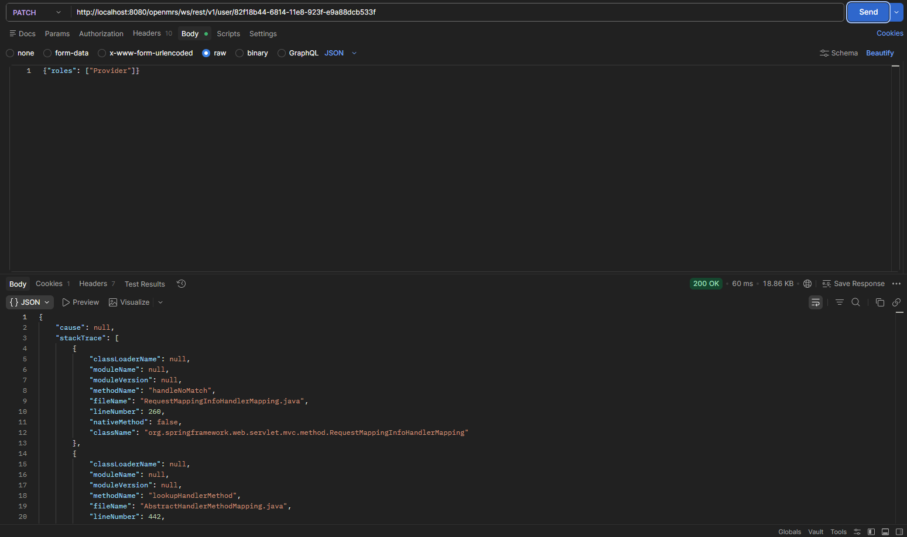
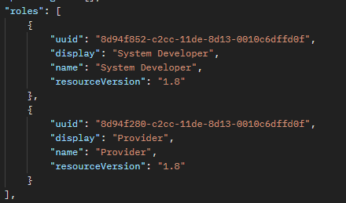
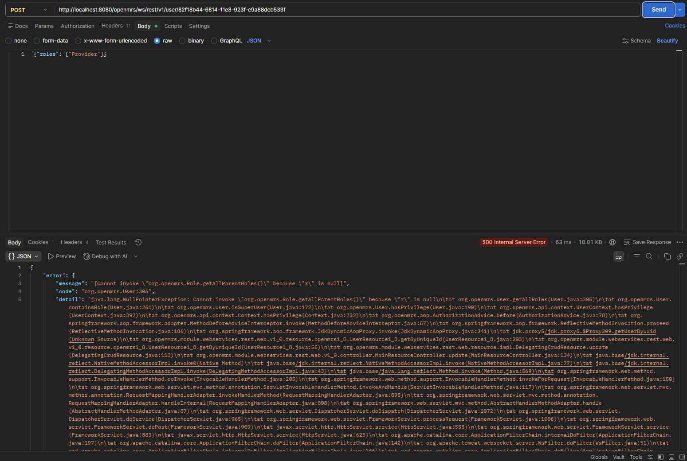
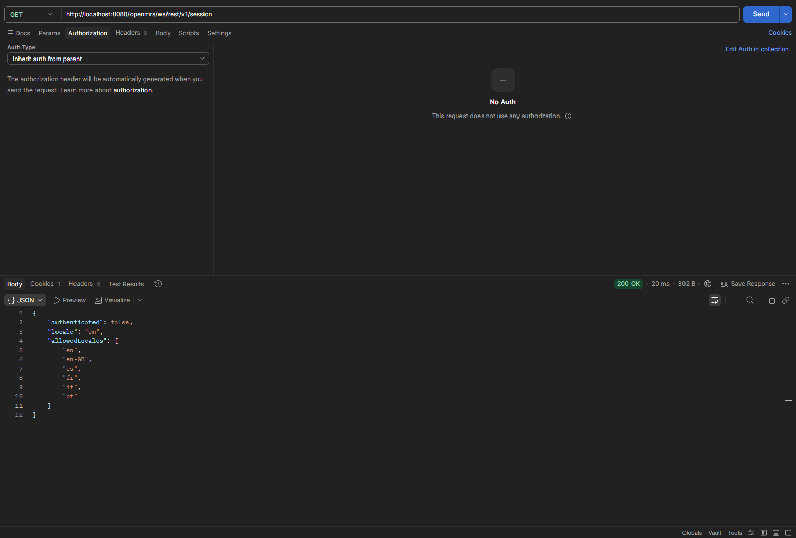
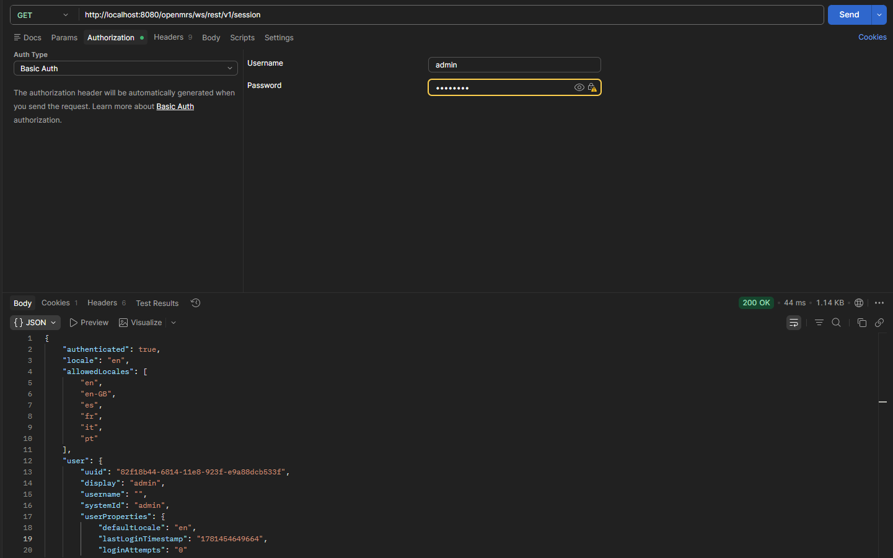

# Gap-analyse-logging — openmrs-module-webservices.rest

Deze analyse richt zich op het ontbreken van audit-logging in de REST-API, getoetst aan de NEN-7510 norm (8.15).

## Logging Gap Analyse Overzicht

| Event / Actie        | Gelogd | Gevoelige data | Compliant NEN-7510 |
| :------------------- | :----- | :------------- | :----------------- |
| `PATCH /user`        | Nee    | Ja             | Nee                |
| `POST /user`         | Nee    | Nee            | Nee                |
| `GET /systemsetting` | Nee    | Nee            | Nee                |
| `GET /session`       | Nee    | Nee            | Nee                |

---

### 1. PATCH /user

- **Huidige situatie:** Bij een `PATCH` request wordt een `200 OK` gegeven, ongeacht of de wijziging (bijv. in `roles`) daadwerkelijk wordt doorgevoerd. Er vindt geen logging plaats van deze actie.
- **Gewenste situatie:** Volgens NEN-7510 8.15 moeten alle wijzigingen in gebruikersdata en autorisatierechten op de juiste manier worden gelogd, inclusief het resultaat van de operatie.
- **Gap:** Het systeem mist een log bij het wijzigingen van data en geeft foute response, waardoor ongeautoriseerde wijzigingspogingen onzichtbaar blijven.
- **Oplossing:** Implementeer een `AuditInterceptor` die op alle `PATCH` operaties de acties van de user vastlegt.
- **Source:** !
   
  
  

### 2. POST /user

- **Huidige situatie:** Het systeem accepteert `POST` verzoeken zonder autorisatiecontrole op UUID van de gebruiker die een verzoek stuurt met een bepaalde rol en geeft vervolgens de verkeerde foutmelding (500 i.p.v. 400). Er is geen log van succesvolle of gefaalde pogingen.
- **Gewenste situatie:** Elke poging tot rechten wijzigen moet worden gelogd.
- **Gap:** Geen mogelijkheid voor hackers die proberen onopvallend hun rechten te verhogen met een bepaalde rol zonder de juiste UUID.
- **Oplossing:** Voeg autorisatiechecks toe op rol wijzigingen en log elke geweigerde of succesvolle wijziging.
- **Source:**
   
  

### 3. GET /systemsetting

- **Huidige situatie:** Ongeautoriseerde toegangspogingen worden geblokkeerd met `401 Unauthorized`, maar dit wordt niet gelogd.
- **Gewenste situatie:** Elke toegang op configuratie endpoints zonder geldige autorisatie moet worden vastgelegd in de logs.
- **Gap:** Het systeem logt geen ongeautoriseerde pogingen.
- **Oplossing:** Zorg dat elk `401 Unauthorized` en `403 Forbidden` incident gelogd wordt.
- **Source:** Bekijk logs.

### 4. GET /session

- **Huidige situatie:** Het endpoint geeft verkeerde sessie informatie (`authenticated: false`) in een `200 OK` response in plaats van een 401 foutcode. Er is geen logging voor deze endpoint omdat hij altijd 200OK terug geeft.
- **Gewenste situatie:** Authenticatie endpoints moeten de juiste HTTP-foutcodes (`401`) geven en elke sessie wijziging moet controleerbaar zijn in de logs.
- **Gap:** Onjuiste informatie over sessie authenticatie door verkeerde status code en gebrek aan logging voor sessies.
- **Oplossing:** Retourneer `401 Unauthorized` bij ongeauthenticeerde toegang en log elke succesvolle inlogpoging.
- **Source:**
   
  
  
