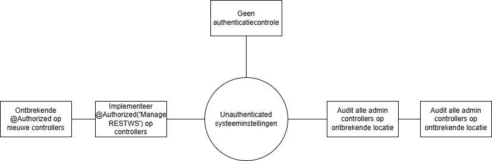
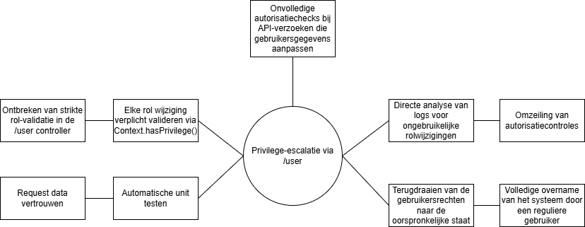

# Risk bowtie openmrs-module-webservices.rest

Dit zijn bowties van onze grootste risicos binnen ons systeem.

---

### 1. Risico: Unauthenticated systeeminstellingen

---

### 2. Risico: Basic Auth onderschepping

_Beschrijving: HTTP Basic Auth verstuurt credentials als Base64; zonder TLS zijn deze vatbaar voor onderschepping._

---

### 3. Risico: Mass assignment

_Beschrijving: Inkomende JSON wordt direct op domeinobjecten gemapped, waardoor gevoelige velden zoals 'uuid' of 'voided' ongeoorloofd kunnen worden gewijzigd._

---

### 4. Risico: Privilege-escalatie via /user

_Beschrijving: Schrijftoegang op `/user` kan leiden tot ongeautoriseerde rol- of privilege-aanpassingen door gebrekkige autorisatiecontrole._

