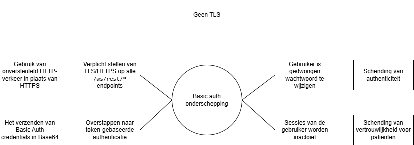
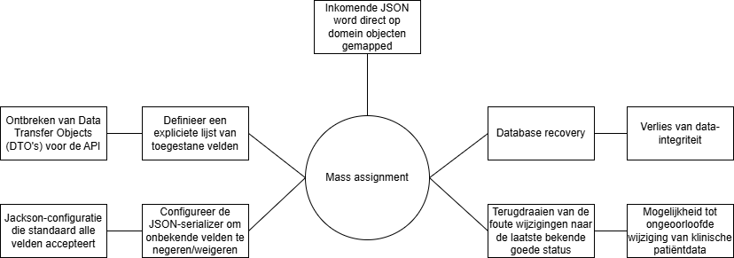

# Risico-evaluatie: CI/CD Pipeline en OpenMRS REST API

Evaluatie op risks en consequenties met keuzes uit het proces van onze CI/CD pipeline.

## 1. Risico Matrix

De risico's zijn geprioriteerd op basis van impact en kans.

| ID      | Risk                                | Kans                | Impact         | Risk (Kans x Imp) |
| :------ | :---------------------------------- | :------------------ | :------------- | :---------------- |
| **I-2** | Unauthenticated systeeminstellingen | Zeer waarschijnlijk | Catastrofaal   | **E5**            |
| **S-1** | Basic Auth onderschepping           | Waarschijnlijk      | Zeer serieus   | **D4**            |
| **T-1** | Mass assignment                     | Waarschijnlijk      | Zeer serieus   | **D4**            |
| **E-1** | Privilege-escalatie via /user       | Waarschijnlijk      | Zeer serieus   | **D4**            |
| **S-2** | Sessie-hijacking                    | Mogelijk            | Serieus        | **C3**            |
| **T-2** | Inputvalidatie / injectie           | Mogelijk            | Serieus        | **C3**            |
| **R-1** | Incomplete auditlogging             | Mogelijk            | Serieus        | **C3**            |
| **I-1** | Stack traces in responses           | Mogelijk            | Minder ernstig | **B3**            |
| **D-1** | Onbeperkte resultaatsets            | Mogelijk            | Serieus        | **C3**            |
| **E-2** | XML Content-Type bypass             | Mogelijk            | Serieus        | **C3**            |
| **I-3** | Gevoelige data via ?v=full          | Onwaarschijnlijk    | Minder ernstig | **B2**            |
| **D-2** | Async herstart-misbruik             | Onwaarschijnlijk    | Minder ernstig | **B2**            |

---

- **[I-2]** Unauthenticated systeeminstellingen: _Hoog_
- **[S-1]** Basic Auth onderschepping: _Hoog_
- **[T-1]** Mass assignment: _Hoog_
- **[E-1]** Privilege-escalatie via /user: _Hoog_

 

---

## 2. Bow-Tie Analyse: [I-2] Unauthenticated systeeminstellingen

### 1. Risico: Unauthenticated systeeminstellingen

_Beschrijving: Implementeer @Authorized voor om authorisatie te waarborgen_

---

### 2. Risico: Basic Auth onderschepping

_Beschrijving: HTTP Basic Auth verstuurt credentials als Base64; zonder TLS zijn deze vatbaar voor onderschepping._

---

### 3. Risico: Mass assignment

_Beschrijving: Inkomende JSON wordt direct op domeinobjecten gemapped, waardoor gevoelige velden zoals 'uuid' of 'voided' ongeoorloofd kunnen worden gewijzigd._

---

### 4. Risico: Privilege-escalatie via /user

_Beschrijving: Schrijftoegang op `/user` kan leiden tot ongeautoriseerde rol- of privilege-aanpassingen door gebrekkige autorisatiecontrole._

## 2. CI/CD proces (Tijdens / Na)

## 4. Evaluatie en Conclusie
