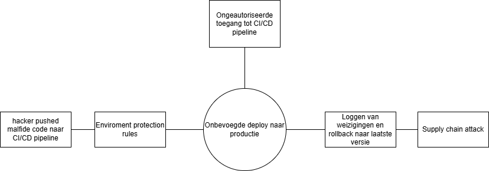
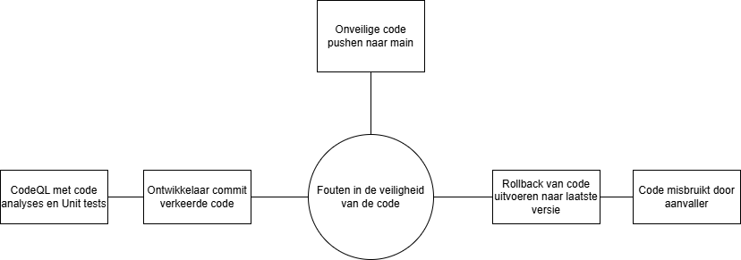
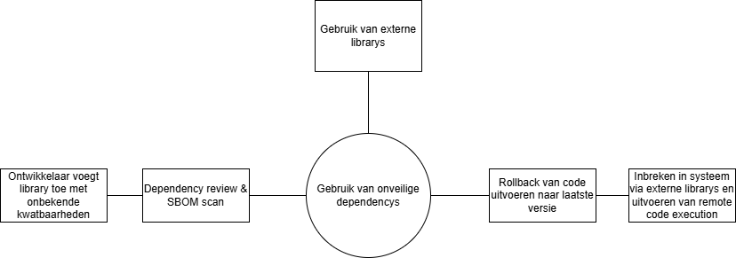

# Risico-evaluatie: CI/CD Pipeline en OpenMRS REST API

Evaluatie op risks en consequenties met keuzes uit het proces van onze CI/CD pipeline.

## 1. Risico Matrix

De risico's zijn geprioriteerd op basis van impact en kans binnen onze CI/CD pipeline.

| ID      | Risico                                 | Kans           | Impact       | Risico Score |
| :------ | :------------------------------------- | :------------- | :----------- | :----------- |
| **P-1** | Unauthorized deploy naar productie     | Mogelijk       | Catastrofaal | **C5**       |
| **P-2** | Fouten in de beveiliging van de code   | Waarschijnlijk | Zeer serieus | **D4**       |
| **P-3** | Gebruik van onveilige dependencys      | Waarschijnlijk | Zeer serieus | **D4**       |
| **P-4** | Instabiele deployment                  | Mogelijk       | Serieus      | **C3**       |
| **P-5** | Perongelijk uitlekken van wachtwoorden | Mogelijk       | Serieus      | **C3**       |

---

- **[P-1]** Onbevoegde uitrol naar productie: _Hoog_
- **[P-2]** Fouten in de beveiliging van de code: _Hoog_
- **[P-3]** Gebruik van onveilige dependencys: _Hoog_

 

## 2 Bow-Tie Analyse

### 1 Risico: Unauthorized deploy naar productie

_Beschrijving: Ongeautoriseerde code-wijziging bereikt de productieomgeving_

---

### 2 Risico: Fouten in de beveiliging van de code

_Beschrijving: Ontwikkelaar commit code met een beveiligingsfout. CodeQL voert Statische Analyses (SAST) & Security Unit Tests_

---

### 3 Risico: Gebruik van onveilige dependencys

_Beschrijving: Ontwikkelaar voegt een library toe met bekende kwetsbaarheid_

## 3. Evaluatie en Conclusie

- Onze deploy naar productie omgeving is beveiligd. Waar we eerst code konden deployen zonder checks word dit nu strict na gegaan.
- Belangrijke functionaliteiten met fouten binnen de code worden getest. Waar het omgaan met autorisatie eerst zonder beveiligin ging word dit nu nagegaan aan de hand van code scans en unittesting
- Onveilige dependencys worden niet uitgevoerd. Malfide code kan niet worden uitgevoerd omdat de dependencys die wij gebruiken nu nagegeken worden aan de hand van SBOM
