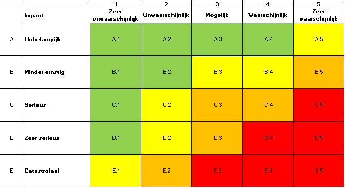

# Risk matrix openmrs-module-webservices.rest

Dit is de risk matrix (kans x impact) om een beeld te krijgen van de risisco's die een dreiging vormen voor onze module.

---

# Risicomatrix

| ID      | Risk                                | Kans                | Impact         | Risk (Kans x Imp) |
| :------ | :---------------------------------- | :------------------ | :------------- | :---------------- |
| **I-2** | Unauthenticated systeeminstellingen | Zeer waarschijnlijk | Catastrofaal   | **E5**            |
| **S-1** | Basic Auth onderschepping           | Waarschijnlijk      | Zeer serieus   | **D4**            |
| **T-1** | Mass assignment                     | Waarschijnlijk      | Zeer serieus   | **D4**            |
| **E-1** | Privilege-escalatie via /user       | Waarschijnlijk      | Zeer serieus   | **D4**            |
| **S-2** | Sessie-hijacking                    | Mogelijk            | Serieus        | **C3**            |
| **T-2** | Inputvalidatie / injectie           | Mogelijk            | Serieus        | **C3**            |
| **R-1** | Incomplete auditlogging             | Mogelijk            | Serieus        | **C3**            |
| **I-1** | Stack traces in responses           | Mogelijk            | Minder ernstig | **B3**            |
| **D-1** | Onbeperkte resultaatsets            | Mogelijk            | Serieus        | **C3**            |
| **E-2** | XML Content-Type bypass             | Mogelijk            | Serieus        | **C3**            |
| **I-3** | Gevoelige data via ?v=full          | Onwaarschijnlijk    | Minder ernstig | **B2**            |
| **D-2** | Async herstart-misbruik             | Onwaarschijnlijk    | Minder ernstig | **B2**            |

---

 

