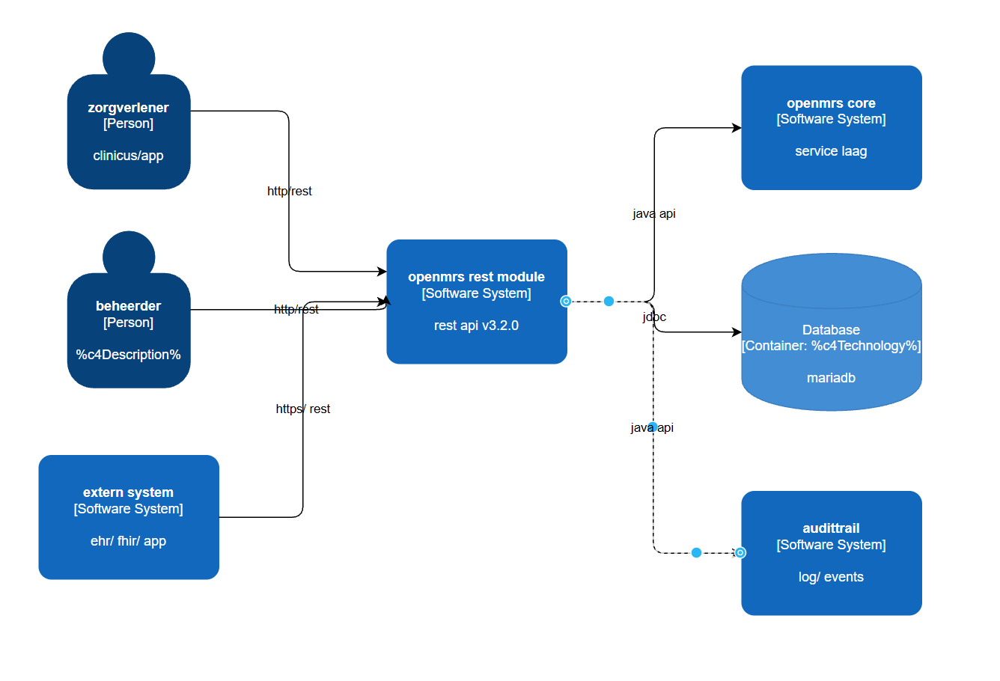
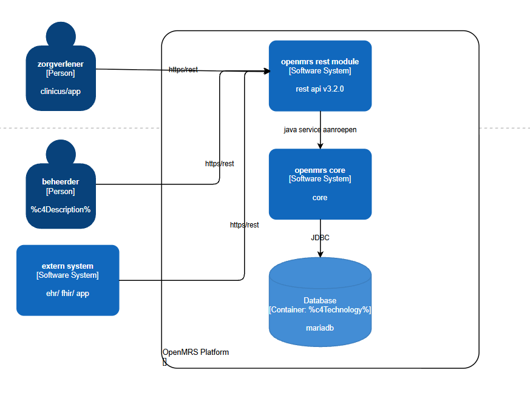
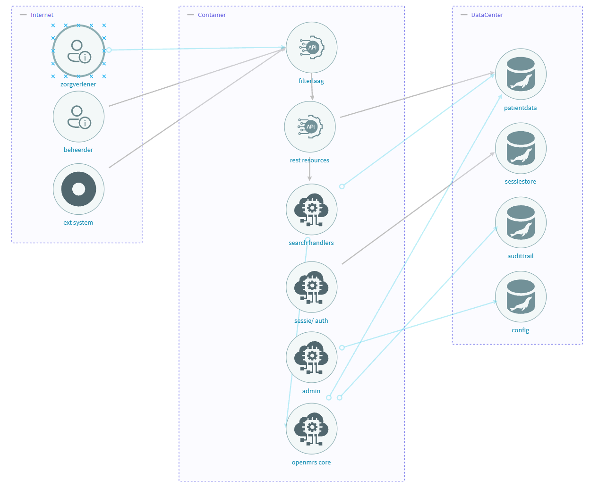

# Threat Model & C4 — OpenMRS REST Webservices Module

**Versie:** 3.2.0 (OpenMRS Core 2.8.3+)
**Datum:** 2026-06-05
**Methodiek:** STRIDE · C4 Model (Simon Brown) · DFD
**Scope:** REST API-laag, authenticatie, autorisatie, gegevensbeveiliging

---

## 1. Systeembeschrijving

De OpenMRS REST Webservices Module is de REST API-laag van het OpenMRS EPD-platform. Ze biedt meer dan 144 REST-resources via `/openmrs/ws/rest/v1/` en ondersteunt CRUD-operaties op klinische data (patiënten, observaties, orders) en beheersfuncties (gebruikers, rollen, modules). Externe systemen zoals mobiele apps en HL7-integraties communiceren uitsluitend via deze laag.

**Technische stack:**
- Java 8 · Spring MVC · Jackson JSON · Hibernate
- HTTP Basic Auth + sessie-gebaseerde authenticatie
- IP-whitelisting via CIDR (`webservices.rest.allowedips`)
- RBAC via OpenMRS privilege-systeem
- OpenMRS-versieondersteuning: 1.8.x t/m 2.8.x
- Drie representatieniveaus: REF · DEFAULT · FULL · CUSTOM
- MariaDB 10.11 als database via Hibernate / OpenMRS Core

---

## 2. C4 Level 0 – Systeemcontextdiagram



| Element | Type | Rol |
|---|---|---|
| Zorgverlener | Externe gebruiker | Raadpleegt en muteert klinische data via REST. |
| Beheerder | Externe gebruiker | Beheert gebruikers, rollen en moduleconfiguratie. |
| Extern Systeem | Extern systeem | HL7-integraties, rapportagesystemen en mobiele apps. |
| OpenMRS Core | Intern systeem | Biedt alle domeinservices en persistentie. |
| MariaDB 10.11 | Database | Slaat alle patiënt- en systeemdata op. |

---

## 3. C4 Level 1 – Containerdiagram



| Container | Verantwoordelijkheid | Binnen scope? |
|---|---|---|
| REST Module (.omod-bestand) | Ontvangt REST-verzoeken, checkt authenticatie en rechten, vertaalt URL naar service-aanroep, retourneert JSON | **Ja – dit project** |
| OpenMRS Core (openmrs.war) | Voert bedrijfslogica uit, valideert data, beheert gebruikers en rechten, stuurt queries naar de database. | Nee – externe afhankelijkheid |
| MariaDB 10.11 | Slaat alle patiënt-, klinische en systeemdata permanent op via JDBC/Hibernate. | Nee – externe afhankelijkheid |

---

## 4. C4 Level 2 – Componentdiagram (REST Module intern)



> Scope: de interne structuur van de REST Module (.omod). Dit is het enige container binnen scope.

| Component | Verantwoordelijkheid | Beveiligingsrelevantie |
|---|---|---|
| `AuthorizationFilter` | Decodeert Basic Auth header, legt sessie aan, stopt **nooit** zelf bij ongeldige credentials ("fails silently") | S-1: TLS niet afgedwongen; credentials leesbaar als Base64 |
| `ContentTypeFilter` | Blokkeert XML content-types via **blacklist** (controleert op substring `xml`) | E-2: afwijkende notaties (`APPLICATION/XML`) glippen er langs |
| `SessionController1_9` | Beheert sessie-endpoints incl. `/session/diag` | I-5: `/session/diag` geeft `serverTime` terug zonder auth |
| `SettingsFormController` | Beheert admin-instellingenpagina via `/module/webservices/rest/settings.form` | I-2/I-4: mist `@Authorized` — elke ingelogde gebruiker kan secrets uitlezen |
| `PasswordResetController2_2` | Verwerkt wachtwoord-reset via activatiesleutel | D-3: geen rate-limiting of lockout op reset-endpoint |
| `DelegatingResourceHandler` | Routeert REST-verzoeken naar de juiste resource-implementatie | T-1: JSON wordt direct op domeinobjecten gemapped |
| `RestHelperService` | Centrale helper voor privilege-checks via `@Authorized` | Enige plek waar `@Authorized` gebruikt wordt — niet op alle controllers |
| `SearchHandler` (per resource) | Verwerkt `?q=`-zoekparameters per resource | T-2: parameters worden als string doorgegeven aan Hibernate-queries |
| `Resource*1_8` klassen | CRUD-implementaties per domeinobject (Patient, Obs, User, …) | E-1: `/user` resource bepaalt autorisatie op rol-/privilege-wijzigingen |

### Datastromen binnen de REST Module

```
HTTP-verzoek
    │
    ▼
[AuthorizationFilter]         ← Basic Auth decode, sessie opzoeken
    │
    ▼
[ContentTypeFilter]           ← Content-Type validatie (blacklist)
    │
    ▼
[DelegatingResourceHandler]   ← URL → resource mapping
    │
    ├──▶ [SettingsFormController]   ← /module/* (BUITEN AuthorizationFilter!)
    │         └── [GlobalProperties] ← levert secrets terug
    │
    ├──▶ [SessionController]        ← /ws/rest/v1/session
    │
    ├──▶ [PasswordResetController]  ← /ws/rest/v1/passwordreset
    │
    └──▶ [Resource*1_8]             ← /ws/rest/v1/{resource}
              └── [SearchHandler]   ← ?q= parameters
              └── [RestHelperService] ← @Authorized checks
```

---

## 4. Beveiligingsdoelen

| ID | Beveiligingsdoel | Wanneer is het goed? |
|---|---|---|
| BG-1 | Vertrouwelijkheid | Patiëntdata is alleen zichtbaar voor geauthenticeerde en geautoriseerde gebruikers. |
| BG-2 | Integriteit | Klinische data kan alleen worden gewijzigd via gevalideerde invoer door bevoegde gebruikers. |
| BG-3 | Beschikbaarheid | De REST API reageert binnen acceptabele tijd en kent geen ongecontroleerde uitval. |
| BG-4 | Authenticiteit | Alleen gebruikers met geldige inloggegevens krijgen toegang tot de API. |
| BG-5 | Onweerlegbaarheid | Alle schrijf- en verwijderacties zijn herleidbaar tot een gebruiker, tijdstip en IP-adres. |
| BG-6 | Autorisatie | Gebruikers kunnen uitsluitend acties uitvoeren waarvoor ze expliciet rechten hebben. |

---

## 5. Trust Boundaries — impliciet vertrouwen

| ID | Wat wordt vertrouwd | Mechanisme | Risico |
|---|---|---|---|
| **TB-1** | IP-adres via allowedips | `request.getRemoteAddr()` — TCP-niveau, niet spoofbaar | LAAG — veilig |
| **TB-2** | Lege allowedips = iedereen toegestaan | `if (candidateIps.isEmpty()) return true` | MIDDEL — standaardinstelling |
| **TB-3** | Geauthenticeerde sessie = volledig vertrouwd | Geen per-request re-auth | MIDDEL — sessie-hijacking geeft volledige toegang |
| **TB-4** | Basic Auth faalt stil | Filter stopt keten niet bij ongeldige credentials | HOOG — endpoints zonder auth-check zijn effectief publiek |
| **TB-5** | Elke ingelogde gebruiker mag cache wissen | `ClearDbCacheController` mist `@Authorized` | HOOG — authenticated ≠ trusted voor admin-acties |
| **TB-6** | swagger.json publiek beschikbaar | Geen filter op `/module/*` | MIDDEL — volledige API-kaart voor aanvallers |
| **TB-7** | OpenMRS Core volledig vertrouwd | REST-laag delegeert zonder extra validatie | LAAG — Core is within trust boundary |
| **TB-8** | MariaDB via Hibernate | ORM abstraheert SQL | LAAG — gerechtvaardigd vertrouwen |

---

## 6. Threat Model – STRIDE-analyse

> **STRIDE:** Spoofing · Tampering · Repudiation · Information Disclosure · Denial of Service · Elevation of Privilege

---

### Spoofing

#### [S-1] Basic Auth onderschepping — `HOOG`

| Veld | Waarde |
|---|---|
| **Container** | REST Module |
| **Omschrijving** | HTTP Basic Auth verstuurt credentials als Base64. Zonder TLS kan een aanvaller deze onderscheppen. |
| **Maatregel** | Verplicht TLS/HTTPS op alle `/ws/rest/*` endpoints. Overweeg token-gebaseerde auth (OAuth2/JWT). |
| **Beveiligingsdoel** | BG-4 Authenticiteit · BG-1 Vertrouwelijkheid |

#### [S-2] Sessie-hijacking — `MIDDEL`

| Veld | Waarde |
|---|---|
| **Container** | REST Module → OpenMRS Core |
| **Omschrijving** | Gestolen sessiecookie geeft toegang als ingelogde gebruiker. Risico bij XSS elders in de app. |
| **Maatregel** | Stel `Secure` + `HttpOnly` in op sessiecookies. Korte sessie-TTL instellen. |
| **Beveiligingsdoel** | BG-4 Authenticiteit · BG-6 Autorisatie |

---

### Tampering

#### [T-1] Mass assignment — `HOOG`

| Veld | Waarde |
|---|---|
| **Container** | REST Module |
| **Omschrijving** | Inkomende JSON wordt direct op domeinobjecten gemapped. Gevoelige velden kunnen worden meegestuurd. |
| **Maatregel** | Definieer een whitelist van schrijfbare velden. Weiger onbekende velden via JSON-configuratie. |
| **Beveiligingsdoel** | BG-2 Integriteit · BG-6 Autorisatie |

#### [T-2] Inputvalidatie / injectie — `MIDDEL`

| Veld | Waarde |
|---|---|
| **Container** | Search Handlers |
| **Omschrijving** | Zoekparameters worden als string doorgegeven. Onvoldoende binding kan HQL/SQL-injectie mogelijk maken. |
| **Maatregel** | Gebruik geparametriseerde Hibernate-queries. Valideer lengte en tekenset van alle parameters. |
| **Beveiligingsdoel** | BG-2 Integriteit |

---

### Repudiation

#### [R-1] Incomplete auditlogging — `MIDDEL`

| Veld | Waarde |
|---|---|
| **Container** | REST Module |
| **Omschrijving** | DELETE- en PURGE-acties worden mogelijk niet volledig gelogd. Gebruikers kunnen acties ontkennen. |
| **Maatregel** | Log alle schrijf- en verwijderacties (wie, wat, wanneer, IP). Gebruik een centrale auditinterceptor. |
| **Beveiligingsdoel** | BG-5 Onweerlegbaarheid |

---

### Information Disclosure

#### [I-1] Stack traces in responses — `LAAG`

| Veld | Waarde |
|---|---|
| **Container** | REST Module |
| **Omschrijving** | `enableStackTraceDetails` staat standaard op `true`. Servicefouten bevatten klassenamen en interne paden. |
| **Maatregel** | Zet `enableStackTraceDetails=false` in productie. Retourneer alleen een correlatie-ID aan de client. |
| **Beveiligingsdoel** | BG-1 Vertrouwelijkheid |

#### [I-2] Onvoldoende autorisatie op instellingenpagina — `HOOG`

| Veld | Waarde |
|---|---|
| **Container** | REST Module |
| **Omschrijving** | Code review bevinding: de `showForm()`-methode in `SettingsFormController` mist de `@Authorized` annotatie. Elke ingelogde gebruiker (ook lage rechten) kan de admin-instellingenpagina bereiken. Niet live getest — Docker omgeving heeft geen admin-weblaag. |
| **Maatregel** | Voeg `@Authorized('Manage RESTWS')` toe. Audit alle admin-controllers op ontbrekende annotaties. |
| **Beveiligingsdoel** | BG-1 Vertrouwelijkheid · BG-6 Autorisatie |

#### [I-4] Secrets-lek via `settings.form/search` — `KRITIEK`

| Veld | Waarde |
|---|---|
| **Container** | REST Module (`SettingsFormController`) |
| **Omschrijving** | Broncode-bevestiging van I-2: `searchProperties()` op regel 50-63 heeft geen `Context.isAuthenticated()` check en geeft zowel naam als **waarde** van elke global property terug — inclusief DB-wachtwoorden en API-keys. Het endpoint valt bovendien onder `/module/webservices/rest/...` en wordt daardoor niet geraakt door `AuthorizationFilter` of IP-allowlist. |
| **Maatregel** | Auth-check toevoegen of endpoint verwijderen. Nooit de property-waarden retourneren. Secrets uit global properties halen (omgevingsvariabelen of secret vault). |
| **Beveiligingsdoel** | BG-1 Vertrouwelijkheid · BG-6 Autorisatie |

#### [I-5] `/session/diag` lekt serverinformatie — `MIDDEL`

| Veld | Waarde |
|---|---|
| **Container** | REST Module (`SessionController1_9`) |
| **Omschrijving** | Het `/session/diag`-endpoint negeert de eigen `token`-parameter (schijnbeveiliging) en geeft ongeauthenticeerd `serverTime` en `authenticated=false` terug als recon-informatie. Rollen en privileges worden alleen voor de al-ingelogde gebruiker zelf getoond. Risico is beperkt maar het endpoint biedt een aanvalsoppervlak voor verkenning. |
| **Maatregel** | Diagnostische velden weglaten of het endpoint achter authenticatie plaatsen. |
| **Beveiligingsdoel** | BG-1 Vertrouwelijkheid |

#### [I-3] Gevoelige data via `?v=full` — `LAAG`

| Veld | Waarde |
|---|---|
| **Container** | REST Module |
| **Omschrijving** | Iedere geauthenticeerde gebruiker kan `?v=full` toevoegen. Interne ID's en auditmetadata worden dan zichtbaar. |
| **Maatregel** | Beperk FULL-representatie tot specifieke rollen. Definieer een aparte FULL-privilege. |
| **Beveiligingsdoel** | BG-1 Vertrouwelijkheid |

---

### Denial of Service

#### [D-1] Resource exhaustion — `MIDDEL`

| Veld | Waarde |
|---|---|
| **Container** | REST Module |
| **Omschrijving** | `maxResultsAbsolute` staat standaard op 100. Veel parallelle grote verzoeken belasten de database. |
| **Maatregel** | Implementeer rate limiting per gebruiker/IP. Voeg een query-time-out toe. |
| **Beveiligingsdoel** | BG-3 Beschikbaarheid |

#### [D-4] Cache-flush DoS via `cleardbcache` (geen @Authorized) — `HOOG`

| Veld | Waarde |
|---|---|
| **Container** | REST Module (`ClearDbCacheController2_0`) |
| **Omschrijving** | `POST /ws/rest/v1/cleardbcache` mist `@Authorized` annotatie. Elke ingelogde gebruiker kan de volledige Hibernate-cache wissen via `sf.getCache().evictAllRegions()`. Herhaald aanroepen forceert de database alle queries opnieuw uit te voeren — potentiële DoS. Endpoint staat bovendien buiten het normale resource-framework en accepteert een vrij JSON-body. |
| **Maatregel** | `@Authorized('Manage Cache')` toevoegen of endpoint beperken tot beheerders. Rate-limiting op het endpoint. |
| **Beveiligingsdoel** | BG-3 Beschikbaarheid · BG-6 Autorisatie |

#### [I-6] API-specificatie publiek beschikbaar via `swagger.json` — `MIDDEL`

| Veld | Waarde |
|---|---|
| **Container** | REST Module (`SwaggerSpecificationController`) |
| **Omschrijving** | `GET /module/webservices/rest/swagger.json` valt onder `/module/*` en staat daarmee **buiten** `AuthorizationFilter` en IP-allowlist. De volledige OpenAPI-specificatie met alle 144+ endpoints, parameters, response-schema's en beveiligingsdefinities is toegankelijk zonder authenticatie. Dit versnelt aanvalsverkenning aanzienlijk. |
| **Maatregel** | `swagger.json` verplaatsen naar `/ws/rest/*` of een auth-check toevoegen op de controller. |
| **Beveiligingsdoel** | BG-1 Vertrouwelijkheid |

#### [D-3] Brute-force op wachtwoord-reset — `MIDDEL`

| Veld | Waarde |
|---|---|
| **Container** | REST Module (`PasswordResetController2_2`) |
| **Omschrijving** | Het wachtwoord-reset endpoint op `/ws/rest/v1/passwordreset/{activationkey}` heeft geen rate-limiting of accountlockout. Een aanvaller kan activatiesleutels geautomatiseerd proberen totdat een geldige sleutel wordt gevonden, waarna het wachtwoord van een willekeurig account wordt overschreven. |
| **Maatregel** | Rate-limiting plus accountlockout na X foute pogingen. Eenmalige, kortlevende reset-token met hoge entropie. |
| **Beveiligingsdoel** | BG-4 Authenticiteit · BG-6 Autorisatie |

#### [D-2] Async herstart-misbruik — `LAAG`

| Veld | Waarde |
|---|---|
| **Container** | REST Module |
| **Omschrijving** | Herhaald herstarten via `/module` kan de server destabiliseren. Geen cooldown aanwezig. |
| **Maatregel** | Beperk `/module` en `/moduleaction` tot beheerders. Voeg een herstart-cooldown toe. |
| **Beveiligingsdoel** | BG-3 Beschikbaarheid |

---

### Elevation of Privilege

#### [E-1] Privilege-escalatie via /user — `HOOG`

| Veld | Waarde |
|---|---|
| **Container** | REST Module → OpenMRS Core |
| **Omschrijving** | Schrijftoegang op `/user` kan rol- of privilege-aanpassing mogelijk maken als de autorisatiecontrole onvolledig is. |
| **Maatregel** | Valideer elke rol-/privilege-mutatie via `Context.hasPrivilege()`. Schrijf integratietests voor escalatiescenario's. |
| **Beveiligingsdoel** | BG-6 Autorisatie |

#### [E-2] Insecure deserialization — `MIDDEL`

| Veld | Waarde |
|---|---|
| **Container** | REST Module |
| **Omschrijving** | Varianten zoals `application/xml;charset=utf-8` kunnen de filter omzeilen. Risico op XXE-aanval. |
| **Maatregel** | Normaliseer Content-Type case-insensitief. Schakel XXE uit in de XML-parserconfiguratie. |
| **Beveiligingsdoel** | BG-2 Integriteit · BG-1 Vertrouwelijkheid |

---

## 6. Risicooverzicht & Prioritering

| ID | Titel | Categorie | Code | Risico | Prioriteit |
|---|---|---|:---:|:---:|:---:|
| **I-2** | Onvoldoende autorisatie op instellingenpagina | Information Disclosure | C3 | **HOOG** | 1 |
| **I-4** | Secrets-lek via `settings.form/search` (broncode-bevestiging I-2) | Information Disclosure | E5 | **KRITIEK** | 1 |
| **S-1** | Basic Auth onderschepping | Spoofing | D4 | **HOOG** | 2 |
| **T-1** | Mass assignment | Tampering | D4 | **HOOG** | 3 |
| **E-1** | Privilege-escalatie via /user | Elevation of Privilege | D4 | **HOOG** | 4 |
| **S-2** | Sessie-hijacking | Spoofing | C3 | MIDDEL | 5 |
| **T-2** | Inputvalidatie / injectie | Tampering | C3 | MIDDEL | 6 |
| **R-1** | Incomplete auditlogging | Repudiation | C3 | MIDDEL | 7 |
| **D-1** | Resource exhaustion | Denial of Service | C3 | MIDDEL | 8 |
| **D-4** | Cache-flush DoS via cleardbcache (geen @Authorized) | Denial of Service | C4 | **HOOG** | 5 |
| **D-3** | Brute-force op wachtwoord-reset | Denial of Service | C3 | MIDDEL | 10 |
| **I-6** | API-spec publiek via swagger.json (buiten filter) | Information Disclosure | C3 | MIDDEL | 11 |
| **E-2** | Insecure deserialization | Elevation of Privilege | D2 | MIDDEL | 10 |
| **I-5** | `/session/diag` lekt serverinformatie | Information Disclosure | B3 | MIDDEL | 11 |
| **I-1** | Stack traces in responses | Information Disclosure | B3 | LAAG | 12 |
| **I-3** | Gevoelige data via ?v=full | Information Disclosure | B2 | LAAG | 13 |
| **D-2** | Async herstart-misbruik | Denial of Service | B2 | LAAG | 14 |

### Aanbevolen aanpak per niveau

| Niveau | Aanpak |
|---|---|
| **KRITIEK** | Direct oplossen vóór productie-deployment. |
| **HOOG** | Oplossen binnen de huidige sprint (1–2 weken). |
| **MIDDEL** | Inplannen in de backlog; compenserende maatregelen tussentijds. |
| **LAAG** | Documenteer aanvaarding of plan op lange termijn. |
